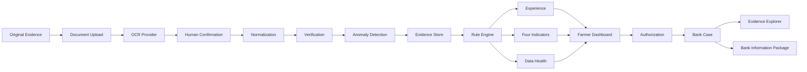

# GreenFin Demo Architecture

## 1. Architecture Goal

Demo 優先：
- 可操作
- 可追溯
- 可解釋
- 可測試
- 可版本化
- 容易替換 Mock 為真實 Provider

避免過早：
- Microservices
- Kubernetes
- Blockchain
- 真實銀行核心系統
- 複雜 AI Agent

## 2. Suggested Stack

### Frontend
- React
- TypeScript
- Vite
- Tailwind CSS
- shadcn/ui
- TanStack Query
- React Router
- Recharts
- Lucide

### Backend
- Python
- FastAPI
- Pydantic
- SQLAlchemy
- Alembic

### Database
- Demo: SQLite
- Design-compatible target: PostgreSQL

## 3. High-level Flow



## 4. Evidence Lineage

```text
Result
→ Calculation Record
→ Rule Version
→ Standardized Record
→ Extracted Field
→ Original Document
```

## 5. Module Boundaries

```text
backend/app/
├── api/
├── models/
├── schemas/
├── repositories/
├── services/
│   ├── documents/
│   ├── ocr/
│   ├── normalization/
│   ├── verification/
│   ├── anomaly/
│   ├── experience/
│   ├── indicators/
│   ├── data_health/
│   ├── authorization/
│   └── reports/
├── rules/
├── seed/
└── core/
```

Frontend 計算禁止事項請見 `AGENTS.md`。
