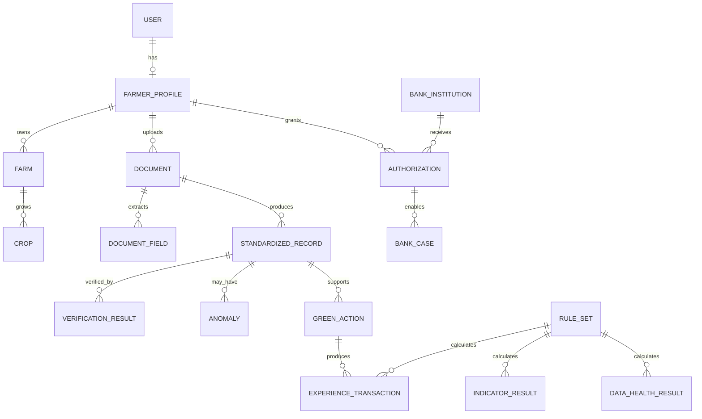

# GreenFin Domain Model

## Core Entities

| Entity | Purpose |
|---|---|
| User | 系統帳號 |
| FarmerProfile | 小農身分與設定 |
| BankInstitution | 金融機構 |
| Farm | 農場 |
| Crop | 作物 |
| Document | 原始文件 |
| DocumentField | OCR / 人工確認欄位 |
| StandardizedRecord | 標準化後資料 |
| VerificationResult | V0–V3 與核驗理由 |
| Anomaly | 異常 |
| GreenAction | 綠色行動 |
| ExperienceTransaction | 經驗值逐筆計算 |
| IndicatorResult | 四大指標結果 |
| DataHealthResult | 分項 Data Health |
| RuleSet | 規則版本 |
| Authorization | 小農授權 |
| BankCase | 銀行端案件視圖 |
| AuditLog | 稽核軌跡 |

## Conceptual Relationships



## Design Rule

所有計算結果應保留足夠 Foreign Key / Reference 以支援：

```text
Result → Rule → Structured Record → Evidence → Original Document
```
