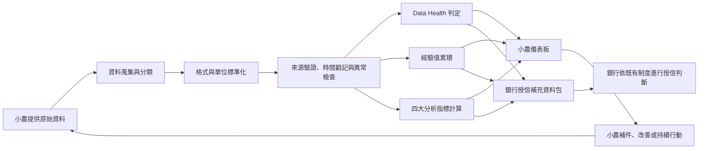

# GreenFin 專案介紹與 AI 討論指南

> 本文件是 GreenFin 團隊的共同專案背景。組員可直接閱讀，也可將全文提供給 ChatGPT、Gemini、Claude、Copilot 等 AI 工具，再針對負責章節提問。
>
> 版本定位：提案討論版。涉及實際授信、法規、資料授權、個資或模型門檻時，仍須由銀行、農業及法遵專家驗證。

---

## 1. 一句話介紹 GreenFin

GreenFin 是一套服務小農與金融機構的「綠色履歷資料治理與授信補充資訊平台」：將小農分散的生產、交易、循環利用、低碳耕作、驗證及學習紀錄，經過標準化、驗證與持續累積後，轉換成可追溯、可解釋的經驗值、四大分析指標與 Data Health，協助銀行更完整地理解傳統財務資料以外的經營表現。

GreenFin **不是自動核貸系統，也不取代銀行既有信用評分與授信政策**。它提供的是銀行可查證的補充資料、風險提示及閱讀摘要，最終授信判斷仍由銀行依其制度作成。

---

## 2. 專案要解決的問題

### 小農面臨的問題

- 許多永續行動確實發生，卻散落在紙本、照片、交易單據、驗證證書及不同系統中。
- 缺少可持續累積的紀錄方式，因此一次性的努力難以形成長期信用資產。
- 傳統授信較重視財務報表、擔保品及聯徵資料，部分小農難以完整呈現實際經營能力。
- 小農通常不知道資料缺在哪裡、如何改善，也不知道哪些行動較有助於呈現穩定經營。

### 銀行面臨的問題

- 小農資料格式不一、來源分散，人工整理與查核成本高。
- 綠色行為若只有自述，可信度及可比較性不足。
- 單一總分無法說明資料品質、經營成熟度或潛在風險的來源。
- 銀行需要的是可追溯、可解釋、具有時間序列的補充資訊，而不是另一個不透明的分數。

### GreenFin 的核心解法

1. 蒐集小農原始資料。
2. 統一欄位、格式、單位及資料期間。
3. 驗證資料來源、真實性與時間戳記。
4. 依可說明的規則累積經驗值。
5. 計算四大分析指標及各資料領域的 Data Health。
6. 產出小農看得懂、銀行可採用的雙版本儀表板與授信補充資料包。

---

## 3. 專案的三層輸出

GreenFin 同時保留「經驗值」與「分析指標」，兩者用途不同，不能擇一取代另一個。

| 輸出層 | 回答的問題 | 主要使用者 | 用途 |
|---|---|---|---|
| 經驗值與等級 | 小農做了多少可驗證、可持續的行動？ | 小農 | 提高參與感、呈現累積進度、引導持續改善 |
| 四大分析指標 | 資料與經營狀況分別表現如何？ | 小農、銀行 | 分析優勢與缺口，避免只看單一總分 |
| Data Health | 每一類資料目前是否足以被採用？問題在哪裡？ | 小農、銀行、平台營運者 | 快速辨識缺漏、過期、矛盾或尚未驗證的資料 |

簡單來說：

- **經驗值**呈現「長期累積與參與成果」。
- **四大分析指標**呈現「不同面向的成熟程度」。
- **Data Health**呈現「底層資料能不能信、能不能用，以及要補什麼」。

---

## 4. 完整商業流程



### 可納入的資料類型

- 農作紀錄：作物、面積、種植期間、投入品及施作方式。
- 交易紀錄：銷售訂單、金額、通路、交付及付款狀況。
- 循環利用紀錄：資材回收、剩餘物再利用及投入量。
- 低碳耕作紀錄：減碳措施、用水、用電、肥料與農藥管理。
- 驗證與產銷紀錄：有機、產銷履歷或其他可查證證明。
- 學習與合作紀錄：課程、培訓、契作及穩定合作關係。
- 其他經合法授權且與經營判斷有關的資料。

---

## 5. 經驗值機制

### 5.1 設計目的

經驗值讓小農看見「每一次有效行動如何形成長期履歷」。它是參與及累積機制，不應直接等同信用分數、違約機率或核貸結果。

### 5.2 建議計算原則

單筆有效行動的經驗值可依下列概念計算：

> 單筆經驗值＝基礎分 × 驗證係數 × 持續係數 × 品質係數

- **基礎分**：依行動的重要程度設定。
- **驗證係數**：第三方或系統串接資料高於單純自述資料。
- **持續係數**：持續完成可獲得合理加成，但須設定上限。
- **品質係數**：完整、及時且無矛盾的資料可取得完整經驗值。

### 5.3 行動級距示例

| 行動層級 | 建議基礎經驗值 | 示例 |
|---|---:|---|
| 日常紀錄型 | 20 | 完成一期農作、用水或資材紀錄 |
| 持續改善型 | 50 | 連續完成低碳措施並提供前後比較資料 |
| 里程碑型 | 100 | 取得或更新有效驗證、完成重要契作紀錄 |

以上是提案階段的規則示例，正式上線前必須以歷史資料、專家意見及試辦結果校準，不能宣稱已能預測違約。

### 5.4 經驗值構面與等級

建議將經驗值分成四個構面，每個構面上限 250，合計 1,000：

1. 綠色生產與驗證。
2. 低碳與資源管理。
3. 循環利用與環境行動。
4. 經營、學習與合作穩定性。

| 等級 | 累積經驗值 | 對使用者的說明 |
|---|---:|---|
| L0 起步 | 0–99 | 已建立帳戶，尚待補充有效資料 |
| L1 萌芽 | 100–249 | 已開始形成可追溯紀錄 |
| L2 成長 | 250–449 | 多項行動已有持續紀錄 |
| L3 穩健 | 450–649 | 資料與永續行動逐漸穩定 |
| L4 成熟 | 650–849 | 多面向均具有穩定且可驗證的表現 |
| L5 示範 | 850–1,000 | 具長期、完整及可供查證的綠色履歷 |

等級只用於溝通累積進度，不代表銀行一定核貸或提供特定利率。

### 5.5 防止灌分與誤導

- 同一事件不得重複計分。
- 各類行動設置期間上限，避免大量低價值紀錄淹沒重要證據。
- 過期、撤銷或被證明不實的資料應停止貢獻，並保留異動軌跡。
- 經驗值與原始證據、規則版本及計算時間必須可以追溯。
- 規則異動不得默默改寫歷史，應保留舊版與新版結果。

---

## 6. 四大分析指標

四個指標均以 0–100 呈現，但各自回答不同問題，不建議直接平均成單一「信用分數」。

| 指標 | 核心問題 | 建議觀察項目 |
|---|---|---|
| 資料完整度 | 應有資料是否齊全？ | 必填欄位、涵蓋期間、資料類別、更新頻率 |
| 資料可信度 | 資料是否可查證且一致？ | 來源強度、第三方驗證、時間戳記、交叉比對、異常程度 |
| 經營成熟度 | 經營是否持續且穩定？ | 生產與交易持續性、合作關係、交付紀錄、培訓與管理習慣 |
| 綠色成熟度 | 綠色行動是否具深度與延續性？ | 驗證、低碳、節水節能、循環利用、改善幅度與持續期間 |

### 建議成熟度燈號

| 分數 | 燈號 | 解讀 |
|---:|---|---|
| 80–100 | 綠燈 | 資料或表現成熟，可作為較完整的補充資訊 |
| 60–79 | 黃燈 | 基本可讀，但仍有缺口或需持續觀察 |
| 0–59 | 紅燈 | 資料或表現不足，不宜單獨採用，應優先補強 |
| 無足夠資料 | 灰燈 | 尚不能判斷，不應將缺少資料直接解讀為表現不佳 |

這些門檻是提案階段的治理規則。正式產品應依資料分布、試辦成果、銀行政策與公平性檢驗調整。

---

## 7. Data Health

Data Health 不是第五個績效指標，而是對底層資料品質的即時診斷。它應針對不同資料領域分別判斷，例如農作、交易、低碳、循環、驗證及合作紀錄。

| 狀態 | 建議定義 | 系統應提供的下一步 |
|---|---|---|
| 綠燈 | 必要資料齊全、在有效期間內、來源可驗證且無重大矛盾 | 維持更新，顯示下次到期日 |
| 黃燈 | 可使用但有輕微缺漏、即將到期或部分仍待驗證 | 明確列出待補欄位或待確認項目 |
| 紅燈 | 關鍵資料缺失、過期、矛盾或驗證失敗 | 暫停該資料的計分與採用，要求補件或申覆 |
| 灰燈 | 尚未提供或樣本不足 | 說明需要哪些資料才能開始判斷 |

Data Health 必須顯示「原因」與「改善方法」，不能只顯示顏色。

---

## 8. 使用者使用流程

### 8.1 小農端

1. 註冊並同意資料使用範圍。
2. 建立農場、作物及經營基本資料。
3. 上傳資料或授權外部系統串接。
4. 查看資料驗證狀態與 Data Health。
5. 依缺漏提示補件或更正。
6. 查看經驗值、等級、四大分析指標及歷史變化。
7. 選擇是否授權特定金融機構於特定期間查看資料。
8. 持續記錄行動，形成可累積的綠色履歷。

### 8.2 小農端 Dashboard 應顯示

- 經驗值總額、等級及距離下一等級的進度。
- 四個經驗值構面的分布與近期新增來源。
- 四大分析指標及時間趨勢。
- 各資料領域的 Data Health、原因、到期日與補件按鈕。
- 最近完成的永續行動及對應證據。
- 待辦事項：缺少資料、驗證即將到期或異常待確認。
- 資料授權紀錄：何人、何時、因何目的查看哪些資料。
- 提醒文字：經驗值及指標為授信補充資訊，不保證核貸。

### 8.3 銀行端

1. 取得小農明確授權。
2. 查看身分、資料範圍、有效期間及驗證狀態。
3. 閱讀四大分析指標、Data Health 與異常提示。
4. 下鑽至指標的原始證據、計算規則與歷史趨勢。
5. 將 GreenFin 資料與聯徵、財務、擔保及銀行內部資料合併判斷。
6. 依銀行既有流程完成人工審查、徵信與授信決策。
7. 將必要的補件需求回傳給小農。

### 8.4 銀行授信補充資料包

- 小農及農場基本資料。
- 本次授權範圍與資料有效期間。
- 經驗值、等級、構面分布及近期變化。
- 四大分析指標、定義、門檻與歷史趨勢。
- 各資料領域的 Data Health 與異常原因。
- 指標對應的原始證據及驗證來源。
- 需要人工注意的風險提示。
- 系統版本、規則版本及產製日期。
- 清楚聲明：本資料包不是核貸建議或信用保證。

---

## 9. 商業模式

### 主要客戶與使用者

- **主要付費客戶**：銀行、農漁會信用部、政策性金融或相關金融機構。
- **主要資料提供者與受益者**：小農、農業合作社及契作組織。
- **合作夥伴**：政府農業平台、驗證機構、農業科技業者、通路商與保險業者。

### 可能收入來源

- 金融機構平台訂閱費。
- 單次授信資料包或查詢費。
- 系統串接、導入及客製化費用。
- 合作社或大型農業組織的管理方案。
- 經同意且符合規範的分析服務。

### 價值交換

- 小農：用持續紀錄換取可攜、可讀的綠色履歷與改善指引。
- 銀行：降低資料蒐集與閱讀成本，增加傳統財務資料以外的判斷依據。
- 平台：透過資料治理、驗證、分析與介接服務取得收入。
- 生態夥伴：取得更一致的資料交換標準，擴大綠色金融與永續農業合作。

---

## 10. 專案競爭定位

競爭分析不能只寫「市場上沒有競爭者」。GreenFin 面對的是不同類型的直接、間接與替代方案。

### 應研究的競爭對象

| 類型 | 對象或方向 | 應比較的內容 |
|---|---|---|
| 國際近似方案 | SatSure、Apollo Agriculture 等農業金融或替代資料方案 | 農業資料來源、信用分析、衛星或遠端資料、銀行介接、商業模式 |
| 臺灣鄰近方案 | 智慧農業管理、產銷履歷、碳盤查及農業數據平台 | 是否只做生產管理，能否轉成金融可讀資料，驗證與授權方式 |
| 現行替代方案 | 銀行及農漁會人工徵信、內部評分、聯徵、政策農貸、農業信用保證 | 成本、覆蓋資料、決策角色及 GreenFin 可補充的缺口 |
| 公共資料與合作平台 | 農業數位整合服務、產銷履歷、有機或其他官方驗證平台 | 可取得欄位、串接條件、法源、資料頻率與合作可能性 |
| 潛在進入者 | 銀行核心系統商、替代信用資料公司、碳管理及永續軟體業者 | 客戶關係、技術能力、資料取得能力與進入速度 |

### 建議比較維度

- 服務對象與付費者。
- 地區與農業情境。
- 資料來源及更新頻率。
- 資料驗證與追溯能力。
- 是否具有持續累積的經驗值機制。
- 是否提供四大分析指標與 Data Health。
- 是否支援銀行系統或介面串接。
- 是否能解釋分數與回到原始證據。
- 是否介入授信決策，以及責任如何界定。
- 收費方式、導入成本及臺灣在地化程度。
- 資料授權、撤回、申覆與法遵機制。

GreenFin 的差異化主張不應是「每一項功能都沒有人做」，而是：市場上的方案多半分別處理農務管理、產銷驗證、政策貸款或信用分析；GreenFin 嘗試把**經驗值、四大分析指標、Data Health、原始證據追溯及銀行可讀資料包**整合成一條可解釋的流程。

---

## 11. 最小可行產品與驗證方式

### 第一階段：概念驗證

- 選定少數作物與合作小農。
- 先處理農作、交易、驗證及低碳等核心資料。
- 建立資料標準、驗證狀態、Data Health 及基礎經驗值規則。
- 完成小農及銀行端原型。

### 第二階段：場域試辦

- 與一家金融機構或農漁會信用部合作。
- 比較導入前後的補件次數、資料整理時間及審查閱讀時間。
- 蒐集小農對操作難度、透明度及改善提示的回饋。
- 檢查不同作物、規模及地區是否產生不公平結果。

### 第三階段：模型校準與擴張

- 依試辦資料調整門檻及權重。
- 擴充外部資料串接與更多作物。
- 建立金融機構介面、稽核軌跡及版本治理。
- 在具備足夠樣本與合法基礎後，才研究指標與授信結果的關聯。

### 建議成效指標

- 資料完整率與驗證成功率。
- 小農持續使用率及按期更新率。
- 平均補件次數與補件完成時間。
- 銀行資料整理及閱讀時間下降幅度。
- 指標可以回溯到原始證據的比例。
- 錯誤、申覆及資料更正案件處理時間。
- 不同小農群體之間的錯誤率與可用性差異。

---

## 12. 資料治理與風險邊界

- **目的限定**：資料只能用於小農已同意的用途。
- **最小必要**：只蒐集完成該用途所需的資料。
- **明確授權**：小農可查看授權對象、範圍、期間並依法撤回。
- **可追溯**：保留資料來源、異動、驗證、計算與查閱紀錄。
- **可解釋**：每個分數、燈號與提示都能說明原因。
- **可申覆**：小農可針對錯誤、過期或誤判資料提出更正。
- **人為覆核**：紅燈或異常不得自動等同拒貸，應由銀行人員判讀。
- **公平性檢驗**：避免因作物、地區、規模或數位能力不同而系統性不利。
- **資安保護**：依敏感程度進行權限控管、加密、備份與事件通報。
- **版本治理**：保存規則版本、產製時間及重新計算原因。

---

## 13. 已確定、暫定與待驗證事項

### 已確定的專案方向

- 所有文件使用「經驗值」，不使用英文縮寫。
- 經驗值與四大分析指標並存。
- 四大指標為資料完整度、資料可信度、經營成熟度及綠色成熟度。
- 保留 Data Health，並使用綠、黃、紅、灰狀態。
- 所有輸出必須可解釋、可追溯，不能直接把綠色行為變成不透明信用分數。
- GreenFin 是授信補充資訊，不取代銀行最終判斷。

### 提案階段的暫定規則

- 經驗值總上限 1,000，分四構面各 250。
- 行動基礎經驗值採 20、50、100 三級。
- 等級採 L0 至 L5。
- 四大指標採 80／60 為綠、黃、紅分界，資料不足為灰燈。

### 正式上線前待驗證

- 不同行動的基礎經驗值、係數與上限。
- 四個指標的精確公式、權重與燈號門檻。
- 不同作物、地區、規模及生產週期的調整方式。
- 可合法串接的資料、授權流程與保存期限。
- 指標與補件效率、風險辨識或授信結果之間的實證關聯。
- 金融機構願意付費的方案與價格。

---

## 14. AI 在討論本專案時必須遵守的規則

將本文件提供給 AI 後，可再附上以下指令：

```text
你是 GreenFin 提案協作顧問。請以本文件為唯一的專案基準，並遵守以下規則：
1. 一律使用「經驗值」，不要使用英文縮寫。
2. 經驗值、四大分析指標與 Data Health 是三種不同輸出，不得混為一談。
3. 不得把經驗值或綠色成熟度直接稱為信用分數、違約機率或核貸結果。
4. GreenFin 只提供授信補充資訊，最終決策仍由銀行作成。
5. 回答時請清楚標示：已確定規則、建議方案、待驗證假設。
6. 若提出分數、門檻、市場數字、法規或競爭者資訊，請說明依據；沒有資料時不得捏造。
7. 若建議修改核心規則，請先說明修改原因、影響範圍與可能風險。
8. 請優先使用臺灣農業、金融及個資情境思考。
```

---

## 15. 組員可以直接複製的提問模板

### 撰寫負責章節

```text
以下是 GreenFin 的完整專案背景。我要負責提案計畫書的「［章節名稱］」。
請先列出本章必須回答的評審問題，再依「問題—解法—證據—效益—風險控制」架構提出詳細大綱。
請把已知事實、合理建議與需要查證的內容分開，不要自行捏造數字。
```

### 檢查內容是否與專案一致

```text
請用 GreenFin 專案基準審查以下文字，找出：
1. 與既定規則矛盾之處；
2. 把經驗值、指標或 Data Health 混淆之處；
3. 缺乏依據或過度承諾之處；
4. 評審可能追問但尚未回答之處；
5. 建議改寫版本。

［貼上文字］
```

### 查競爭者

```text
請研究 GreenFin 的「［競爭者或競爭類型］」，只使用可查證且附日期的資料。
請比較服務對象、付費者、資料來源、驗證方式、信用或風險分析、可解釋性、銀行介接、商業模式、臺灣適用性及資料治理。
最後說明它與 GreenFin 是直接競爭、間接競爭、替代方案或合作對象，以及判斷理由。
```

### 設計指標或規則

```text
請針對 GreenFin 的「［指標／經驗值行動］」提出可解釋的計算方案。
方案必須包含資料來源、分母與分子、有效期間、缺值處理、異常處理、驗證強度、門檻依據、防止灌分方式、公平性風險及正式上線前的驗證方法。
請勿直接假設該指標能預測違約或保證核貸。
```

### 模擬評審問答

```text
請扮演金融科技獎評審，依 GreenFin 專案提出 15 個尖銳問題，涵蓋市場需求、資料來源、資料可信度、授信價值、商業模式、競爭者、法遵、個資、公平性及落地計畫。
每題請提供一個不誇大、可防守的建議回答，並指出回答前還需要準備哪些證據。
```

---

## 16. 常見問題

### 經驗值是不是信用分數？

不是。經驗值呈現小農完成並留下證據的行動累積；信用評估還需要財務、聯徵、還款能力、擔保及銀行政策等資料。

### 經驗值高，銀行就一定會核貸嗎？

不會。它只能讓銀行更完整地理解小農的經營及永續履歷。

### 為什麼還需要四大分析指標？

因為相同經驗值可能來自不同類型的行動。四大指標能分開呈現資料是否完整可信、經營是否穩定，以及綠色實踐是否成熟。

### Data Health 和資料完整度有何不同？

資料完整度是整體分析指標之一；Data Health 是針對每個資料領域進行即時診斷，除了缺漏，也處理過期、矛盾、驗證失敗或資料不足。

### 灰燈和紅燈有何不同？

灰燈代表資料不足、不能判斷；紅燈代表已有資料顯示關鍵缺失、過期、矛盾或驗證失敗。不能把沒有資料直接當成負面表現。

### 為什麼不能直接把所有指標加總？

加總雖然容易閱讀，卻可能掩蓋資料不足或不同風險來源。在取得足夠實證前，分項呈現更透明，也較適合銀行人工判讀。

### 誰付費？

初步設定由需要降低資料蒐集與閱讀成本的金融機構付費，小農可免費或低門檻使用核心紀錄功能；最終方案仍須透過訪談與試辦驗證。

### GreenFin 最大的護城河是什麼？

不是單一演算法，而是農業資料標準、可驗證資料來源、長期履歷、可解釋規則、授權治理，以及與金融機構工作流程的整合能力。

---

## 17. 團隊協作原則

- 提案中第一次出現專有名詞時，必須附上白話定義。
- 同一數字只能有一個正式來源，並記錄資料年度與查詢日期。
- 各章不要各自發明經驗值、指標名稱或燈號門檻。
- 尚未驗證的效果使用「預期、規劃、試辦驗證」，不要寫成已證實成果。
- 寫到銀行價值時，要同時寫出銀行如何使用及不應如何使用。
- 寫到小農資料時，要同時說明授權、查閱、更正及撤回機制。
- 修改核心定義後，應同步更新本文件、專案藍圖及提案計畫書。

---

## 18. 相關檔案

- 專案內容說明藍圖：`output/documents/GreenFin_經驗值與指標雙軌_專案內容說明藍圖.docx`
- 提案章節與競爭分析指南：`output/documents/2026台北金融科技獎_提案章節重點與競爭分析指南.docx`
- 提案格式來源：`附件二、2026台北金融科技獎提案計畫書.pdf`
- 已確認流程圖：請使用團隊目前確認的「綠色履歷資料治理與經驗值累積流程」圖，圖面不需修改。
